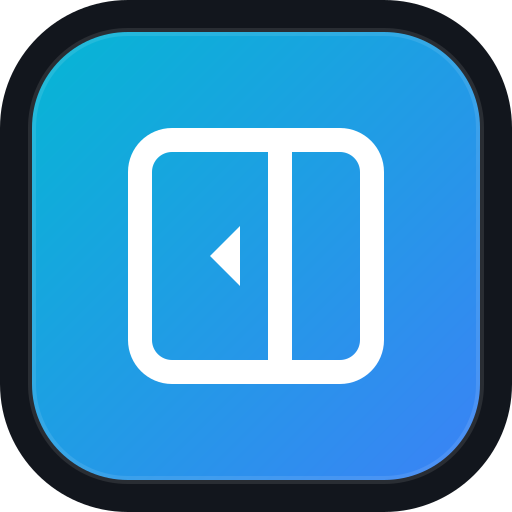

<div align="center">



# Barra Lateral Windows

**Barra lateral flutuante para Windows — lançada com um toque, fixada na borda da tela.**

[](https://tauri.app)
[](https://www.rust-lang.org)
[](https://www.microsoft.com/windows)
[](LICENSE)
[](https://github.com/Blastoles/Barra_Lateral_Windows/releases)

</div>

---

## 📖 Sobre

**Barra Lateral Windows** é uma sidebar flutuante leve e discreta que fica fixada na borda da tela. Com um clique ela se expande revelando seus atalhos personalizados: URLs, aplicativos, ou sons/músicas — tudo acessível de forma instantânea sem poluir sua barra de tarefas.

Construída com **Rust + Tauri v2** e uma interface **glassmorphism** inspirada no macOS, ela foi pensada para quem quer produtividade sem abrir mão do visual.

---

## ✨ Funcionalidades

### 🖱️ Interface
- **Drawer animado** — expande e colapsa suavemente a partir da borda da tela
- **Posição configurável** — escolha entre o lado **Direito** ou **Esquerdo** da tela
- **Suporte a múltiplos monitores** — selecione em qual monitor a barra deve ficar
- **Visual glassmorphism** — efeito de vidro fosco com blur, gradientes e tipografia refinada
- **Sem barra de título** — janela transparente, sem decorações, sempre visível (`alwaysOnTop`)

### ⚡ Atalhos & Automações
- **Atalhos de URL** — abra qualquer site no navegador padrão com um clique
- **Atalhos de App** — execute aplicativos ou comandos do Windows diretamente (PowerShell, CMD, etc.)
- **Atalhos de teclado globais** — acione qualquer atalho com combinações como `Alt+1`, `Ctrl+Alt+G` de qualquer lugar do Windows
- **Player de mídia interno** — reproduza arquivos `.mp3`, `.mp4`, `.wav`, `.m4a`, `.ogg` e `.webm` sem abrir nenhum player externo

### ⚙️ Gerenciamento
- **Adicionar, editar, reordenar e remover** atalhos por uma interface visual completa
- **Mover para cima / Mover para baixo** — reorganize a ordem dos atalhos
- **Seletor de arquivos nativo** — botão `📁 Procurar` para selecionar apps e arquivos de mídia
- **Backup e restauração** — exporte e importe suas configurações em JSON (`📥 Exportar` / `📤 Importar`)
- **Restaurar padrões** — volte à configuração original com um clique

### 🔒 Resiliência & Sistema
- **Inicialização automática com o Windows** — a barra inicia junto com o sistema (configurável)
- **Instância única** — impede múltiplos processos do mesmo aplicativo
- **System Tray (Bandeja do Sistema)** — ícone discreto ao lado do relógio com menu rápido
- **Proteção contra fechamento acidental** — fechar a janela apenas oculta para a bandeja; o processo continua ativo em segundo plano

### 💾 Armazenamento Profissional
- **Persistência em AppData** — configurações salvas em `%APPDATA%\com.blastoles.barralateral\shortcuts.json`
- **Cópia automática de mídia** — arquivos de áudio/vídeo são copiados para a pasta do programa, protegendo contra exclusão acidental do original
- **Asset Protocol** — reprodução de mídia via `http://asset.localhost/` com suporte a Range Headers (HTTP 206)

---

## 🧱 Stack Tecnológico

| Camada | Tecnologia |
|--------|-----------|
| Backend / Shell | **Rust 2021** |
| Desktop Framework | **Tauri v2** |
| Atalhos Globais | `tauri-plugin-global-shortcut` |
| Auto-Start | `tauri-plugin-autostart` |
| Instância Única | `tauri-plugin-single-instance` |
| Diálogos Nativos | `rfd` crate |
| Abertura de URLs/Apps | `open` crate |
| Frontend | **HTML + CSS + JavaScript Vanilla** |
| Estilo | Glassmorphism (backdrop-filter, CSS vars) |
| Build | `@tauri-apps/cli` v2 |

---

## 📋 Pré-requisitos

Antes de começar, certifique-se de ter instalado:

- [**Rust**](https://rustup.rs/) (1.77+) com `cargo`
- [**Node.js**](https://nodejs.org/) (18+)
- [**Visual Studio C++ Build Tools**](https://visualstudio.microsoft.com/visual-cpp-build-tools/) ou **MinGW-w64**
- [**WebView2 Runtime**](https://developer.microsoft.com/microsoft-edge/webview2/) (normalmente já incluso no Windows 10/11)

---

## 🚀 Instalação e Uso

### Instalador MSI

Baixe o instalador `.msi` na aba [Releases](https://github.com/Blastoles/Barra_Lateral_Windows/releases) e execute. A barra lateral será instalada e iniciará automaticamente com o Windows.

### Modo Desenvolvimento (Hot Reload)

```bat
dev.bat
```

> Mata instâncias anteriores, configura o PATH e executa `npm run dev` com builds incrementais para máxima velocidade.

### Build de Produção

```bat
build.bat
```

> Gera o instalador em `src-tauri/target/release/bundle/msi/`.

### Manualmente

```bash
npm install
npm run dev     # desenvolvimento
npm run build   # produção
```

---

## ⌨️ Atalhos de Teclado Globais

Cada atalho pode ter um hotkey do sistema operacional associado. Funciona em **qualquer janela ativa** do Windows.

**Atalhos padrão:**

| Atalho | Ação |
|--------|------|
| `Alt+1` | Abrir PowerShell |
| `Alt+2` | Abrir Prompt de Comando |

**Exemplos de combinações personalizadas:**

```
Alt+Shift+1
Ctrl+Alt+G
Alt+Shift+4
```

Configure os hotkeys na tela de **Configurações** (botão ⚙️ na barra lateral).

---

## ⚙️ Configurações

Clique no ícone ⚙️ na barra lateral para acessar:

### Gerenciar Atalhos
- **Adicionar** novo atalho (URL, App ou Player de Som)
- **Editar** atalhos existentes
- **Reordenar** com botões ▲ ▼
- **Remover** atalhos indesejados
- **Procurar** arquivos com seletor nativo do Windows

### Opções do Sistema
- **Lado da Barra na Tela** — Direito (padrão) ou Esquerdo
- **Monitor de Exibição** — Automático ou monitor específico (suporte multi-monitor)
- **Inicializar com o Windows** — ativado por padrão

### Backup
- **📥 Exportar Backup** — salva todas as configurações em arquivo JSON
- **📤 Importar Backup** — restaura configurações a partir de um arquivo JSON
- **Restaurar Padrões** — volta à configuração original

---

## 🎵 Player de Mídia Interno

Arquivos de áudio e vídeo são reproduzidos **diretamente dentro da barra lateral**, sem abrir nenhum aplicativo externo.

**Formatos suportados:** `.mp3` · `.mp4` · `.wav` · `.m4a` · `.ogg` · `.webm` · `.mov`

O backend Rust serve os arquivos via **Asset Protocol** (`http://asset.localhost/`), suportando Range Headers (HTTP 206) para reprodução otimizada pelo WebView2.

---

## 📁 Estrutura do Projeto

```
Barra_Lateral_Windows/
├── src/                        # Frontend (HTML, CSS, JS)
│   ├── index.html              # Interface principal
│   ├── styles.css              # Estilos glassmorphism
│   └── main.js                 # Lógica da UI e comunicação Tauri
├── src-tauri/                  # Backend Rust
│   ├── src/
│   │   ├── lib.rs              # Comandos Tauri (drawer, atalhos, mídia, tray)
│   │   └── main.rs             # Entrypoint
│   ├── Cargo.toml              # Dependências Rust
│   ├── tauri.conf.json         # Configuração da janela e bundle
│   └── capabilities/
│       └── default.json        # Permissões Tauri
├── dev.bat                     # Script de desenvolvimento rápido
├── build.bat                   # Script de build de produção
├── package.json                # Dependências Node
└── app-icon.svg                # Ícone do aplicativo
```

---

## 🤝 Contribuindo

Contribuições são bem-vindas! Sinta-se livre para abrir uma _issue_ ou enviar um _pull request_.

1. Fork o repositório
2. Crie uma branch: `git checkout -b feature/minha-feature`
3. Commit suas mudanças: `git commit -m 'feat: adicionar minha feature'`
4. Push: `git push origin feature/minha-feature`
5. Abra um Pull Request

---

## 📄 Licença

Este projeto está sob a licença **MIT**. Veja o arquivo [LICENSE](LICENSE) para detalhes.

---

<div align="center">

Feito com ❤️ por **[Blastoles](https://github.com/Blastoles)**

</div>
